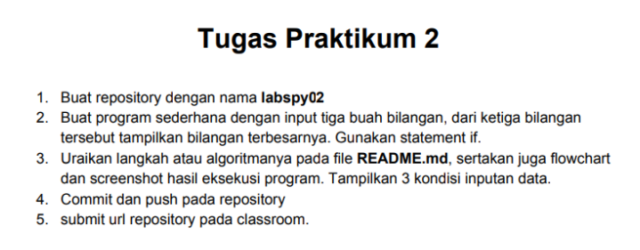
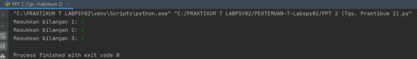
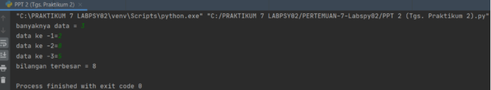

# PERTEMUAN 7

## NAMA: RAFI UBAIDILLAH
## KELAS: TI. 20. A. 1
## NIM: 312010090

Pada pertemuan 7 tugas PPT ke-2 ini, saya diberikan beberapa tugas oleh dosen saya yaitu



untuk mencari sebuah nilai maksimal dari 3 data yang sebelumnya telah diinput, dan setelah mendapat nilai maksimalnya, dirubah menjadi dalam sebuah bentuk flowchart.

## TUGAS PRAKTIKUM 2

MENGINPUT DATA DAN MENCARI NILAI MAX

Pertama-tama disini saya akan mencoba untuk menginput 3 data dengan menggunakan syntax berikut terlebih dahulu.

````
a = int(input("Masukkan bilangan 1: "))
b = int(input("Masukkan bilangan 2: "))
c = int(input("Masukkan bilangan 3: "))
````

Masukan syntax tersebut dengan angka yang kalian inginkan.



Jika sudah mendapat tampilan seperti gambar diatas, maka kalian sudah berhasil menginput ketiga data tersebut.

Langkah selanjutnya adalah mencari tahu nilai terbesar (max) dari ketiga data tersebut. Sebelum memulainya kalian harus memasukan terlebih dahulu berapa jumlah data yang akan kalian kerjakan dari ketiga data tersebut dengan syntax

````
N=int(input("banyaknya data = "))
````

Karena disini saya diberi tugas mencari nilai max dari ketiga data maka saya akan menggunkan semua data diatas.

````
if N>0:
    i=1
    x=int(input("data ke -"+str(i)+"="))
    max=x;total=x
    for i in range(2,N+1):
        x=int (input("data ke -"+str(i)+"="))
        total+=x
        if max<x:
            max=x

    print("bilangan terbesar =",max)
````

Selanjutnya kalian bisa langsung memasukan syntax ini untuk melengkapi syntax diatas supaya bisa berjalan dengan baik seperti pada gambar dibawah ini.



Maka jika digabungkan, cara untuk mencari nilai max dari ketiga data yang diinputkan adalah dengan menggunakan syntax

````
N=int(input("banyaknya data = "))
if N>0:
    i=1
    x=int(input("data ke -"+str(i)+"="))
    max=x;total=x
    for i in range(2,N+1):
        x=int (input("data ke -"+str(i)+"="))
        total+=x
        if max<x:
            max=x

    print("bilangan terbesar =",max)
````

Seperti inilah hasil akhirnya

